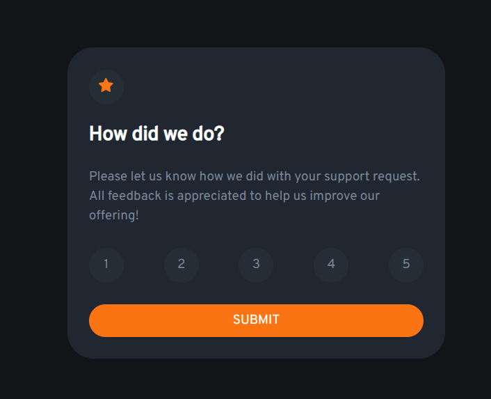

# Frontend Mentor - Interactive rating component solution

This is a solution to the [Interactive rating component challenge on Frontend Mentor](https://www.frontendmentor.io/challenges/interactive-rating-component-koxpeBUmI).

## Table of contents

- [Overview](#overview)
  - [The challenge](#the-challenge)
  - [Screenshot](#screenshot)
  - [Links](#links)
- [My process](#my-process)
  - [Built with](#built-with)
  - [What I learned](#what-i-learned)
  - [Continued development](#continued-development)
  - [Useful resources](#useful-resources)
- [Author](#author)

## Overview

### The challenge

Users should be able to:

- View the optimal layout for the app depending on their device's screen size
- See hover states for all interactive elements on the page
- Select and submit a number rating
- See the "Thank you" card state after submitting a rating

### Screenshot



### Links

- Solution URL: [My solution in ReplIt](https://replit.com/@MartinaRandulo1/FE-Rating-Component)

## My process

### Built with

- Semantic HTML5 markup
- CSS custom properties
- Flexbox
- Bootstrap

### What I learned

Use this section to recap over some of your major learnings while working through this project. Writing these out and providing code samples of areas you want to highlight is a great way to reinforce your own knowledge.

To see how you can add code snippets, see below:

```html
<h1>Some HTML code I'm proud of</h1>
<h2>Using CSS variables</h2>
```

```css
:root {
  --orange: hsl(25, 97%, 53%);
  --grey1: hsl(217, 12%, 63%);
}
button.circle:hover {
  background-color: var(--grey1);
  color: var(--white);
}
```
```js
for (var i = 0; i < userRatingArr.length; i++) {
    userRatingArr[i].addEventListener("mousedown", function(e) {
      userRatingDecision = this.innerHTML;
    });
  }
```


### Continued development

I would like to dig more deep into flexbox and bootstrap.


### Useful resources

- [How to flexbox](https://css-tricks.com/snippets/css/a-guide-to-flexbox/) - in this site, there are nicely described basics of flexbox with helpful illustrations and examples


## Author

- Frontend Mentor - [@rubesovm](https://www.frontendmentor.io/profile/rubesovm)


